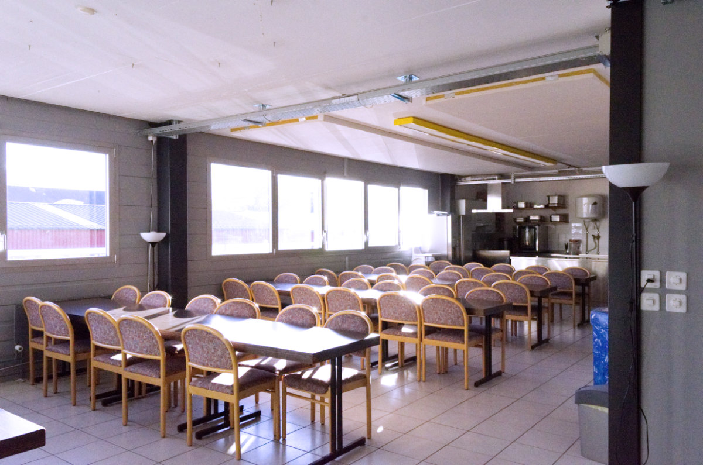
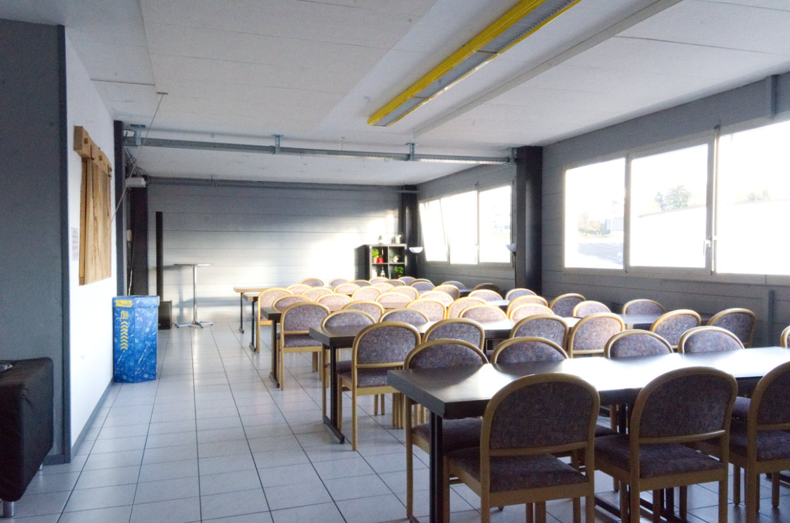
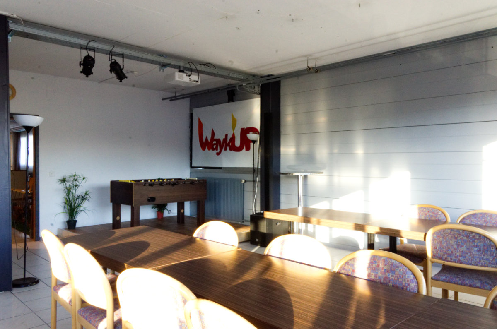
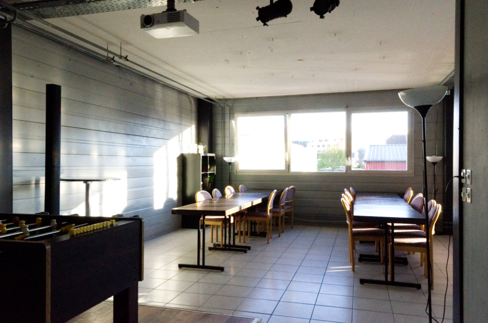
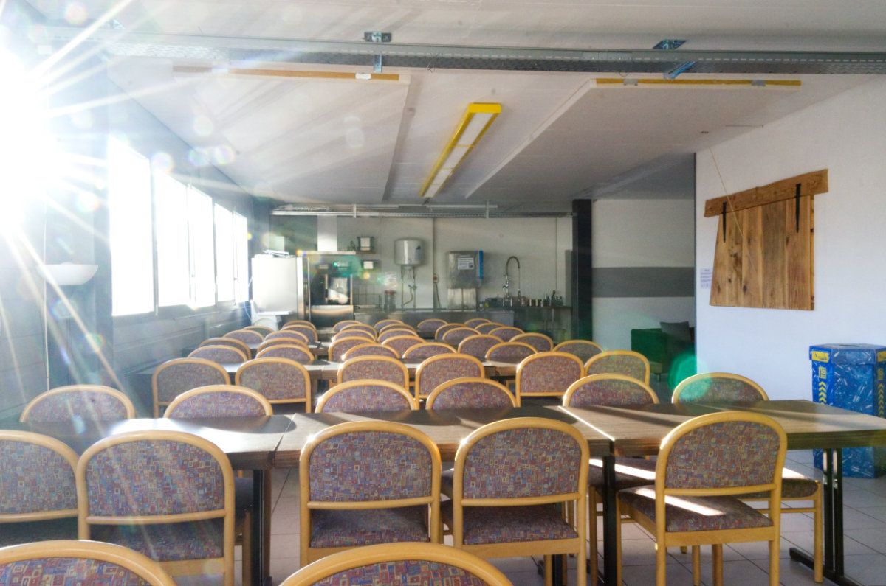
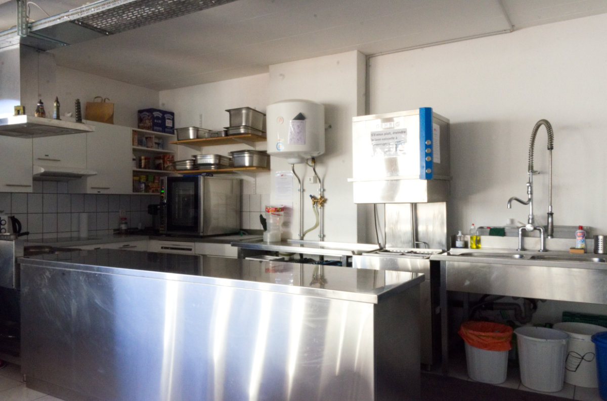
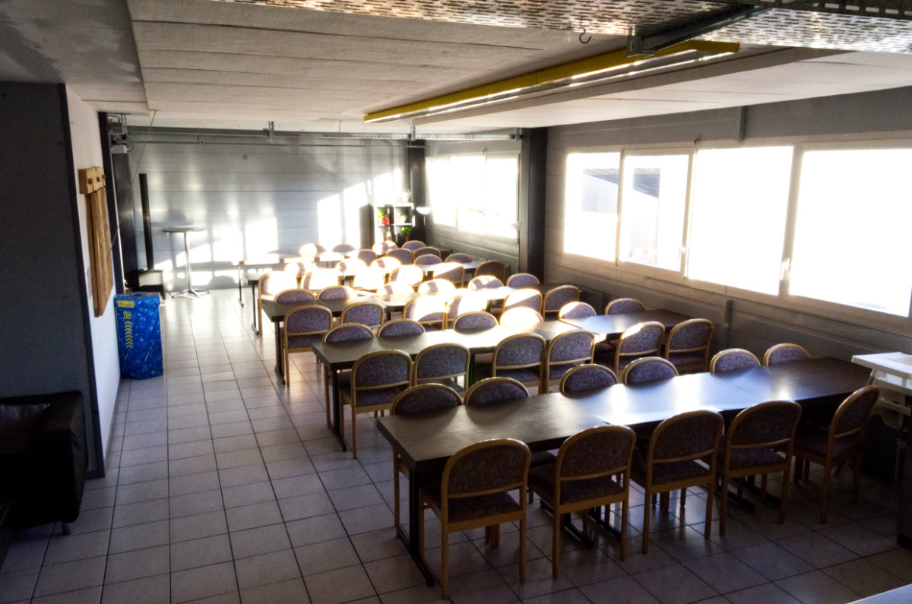
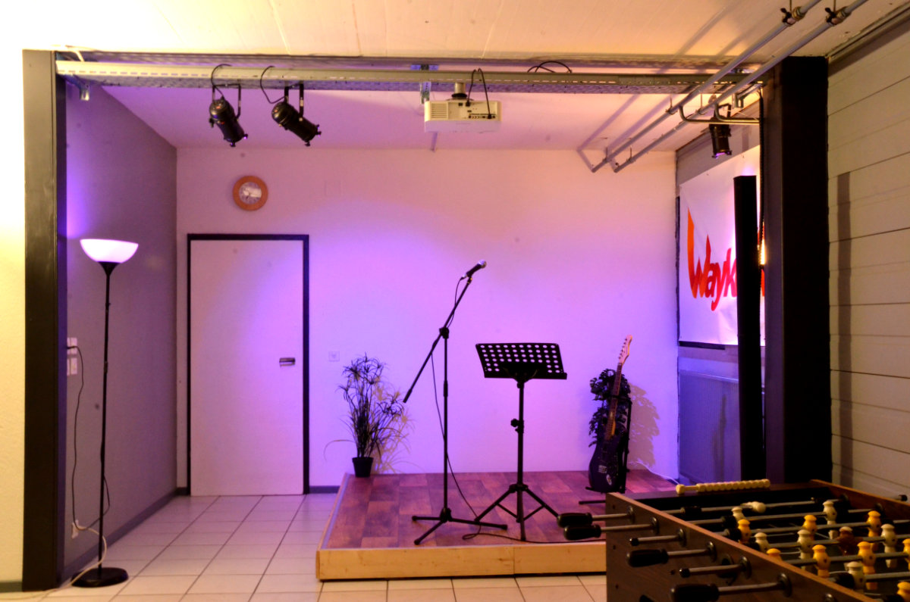

La cafétéria permet de cuisiner et servir facilement 50 personnes et possède notamment un combi-steamer et un lave-vaisselle professionnel. Un coin lounge se trouve au fond de la cafétéria et possède des canapés où une dizaine de personnes peuvent s’installer confortablement. Un beamer est également à disposition.

  

  

  

  

  

  

  

  

