La grande salle peut acceuillir 150 places assise.

La grande salle est sonorisée et des micros pour voix ou instruments de musique sont disponibles. Deux beamers assurent une projection optimale dans la salle. Un technicien peut assurer la sonorisation et la projection. Au fond de la salle, un espace pour les bébés est aménagé avec des jouets. Une cabine de traduction insonorisée est également à disposition.

  
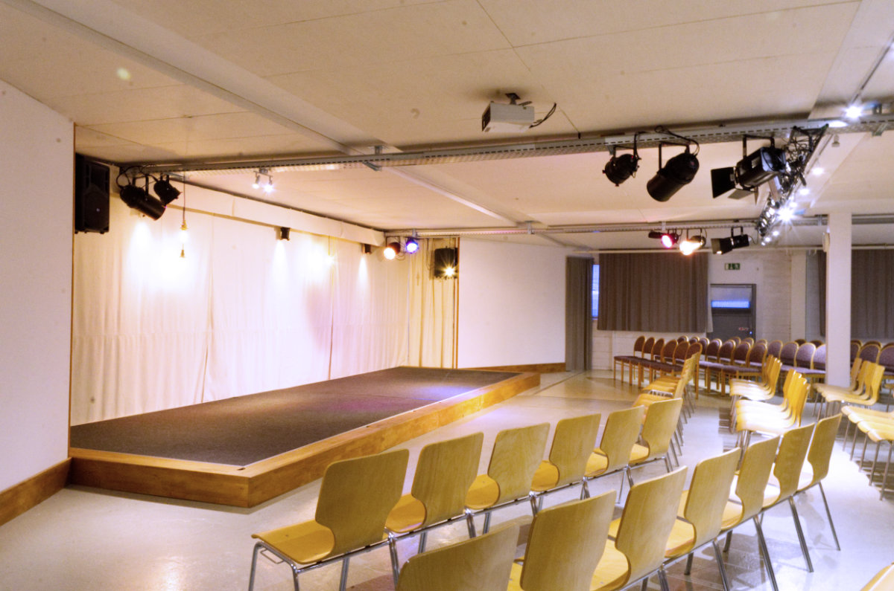

  
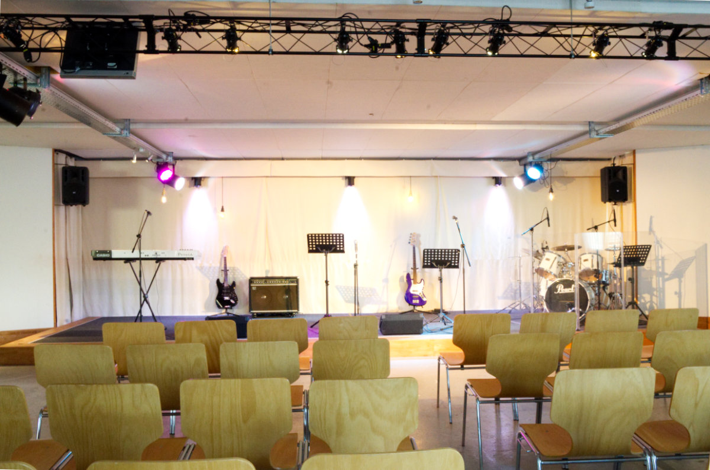

  
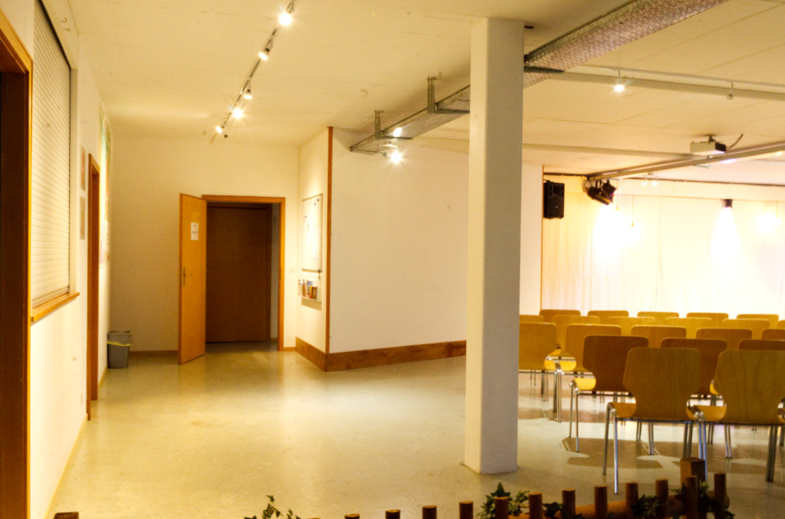

  

  
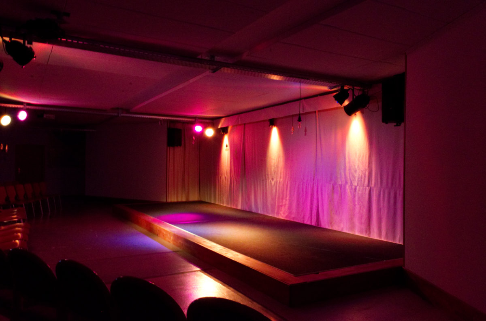

  
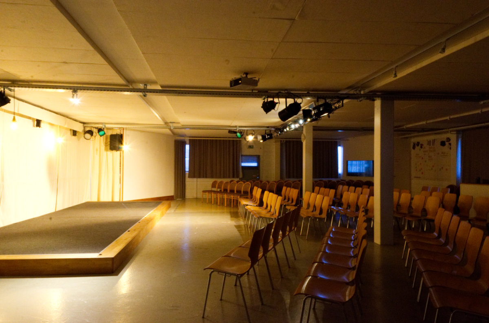

  
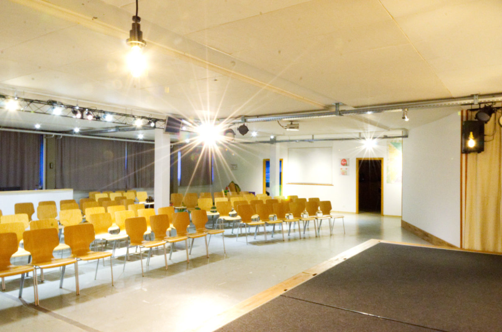

  
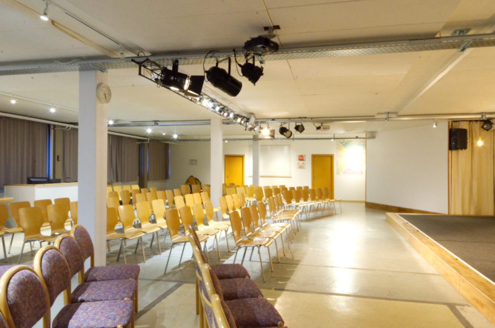

  
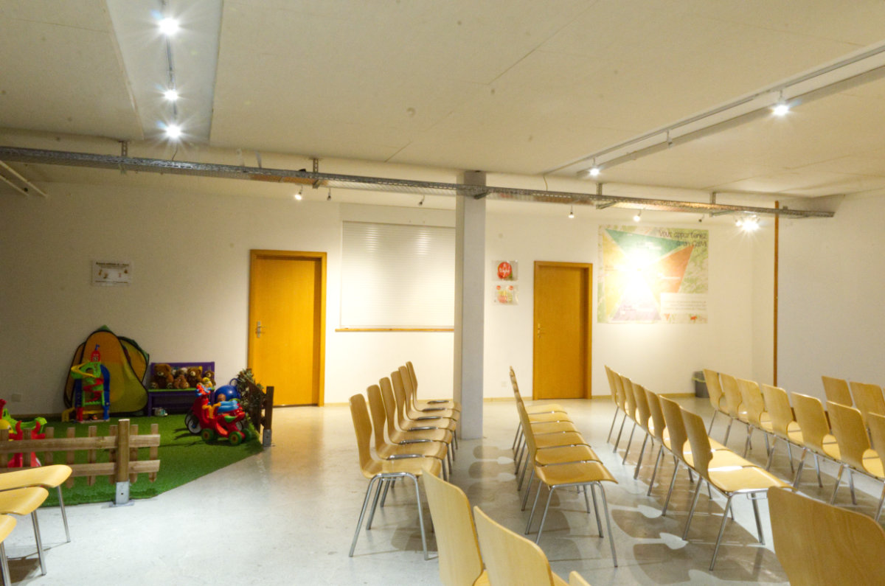

  
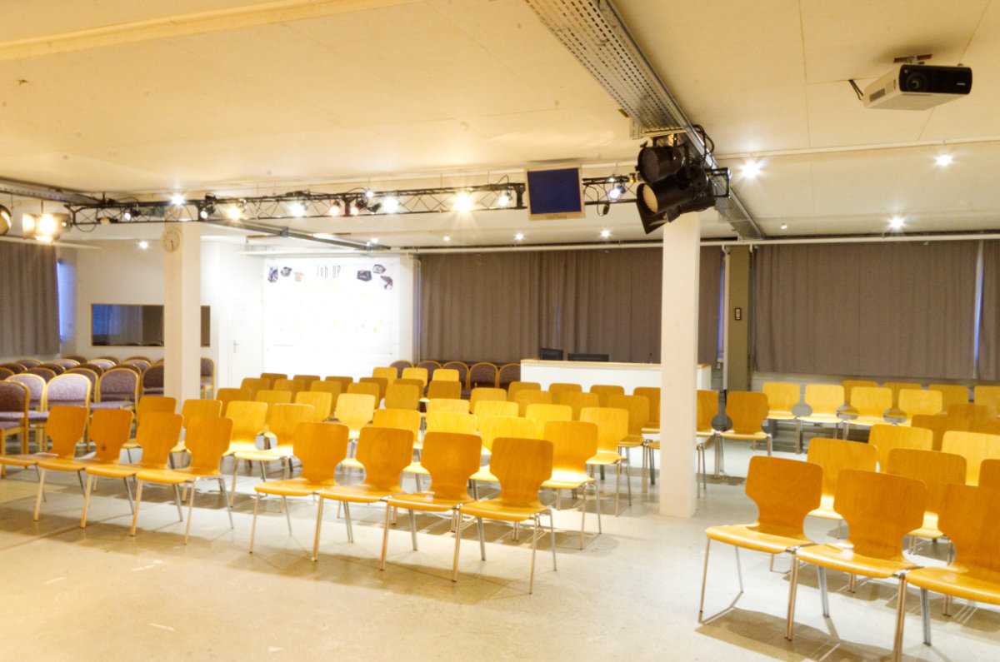

  
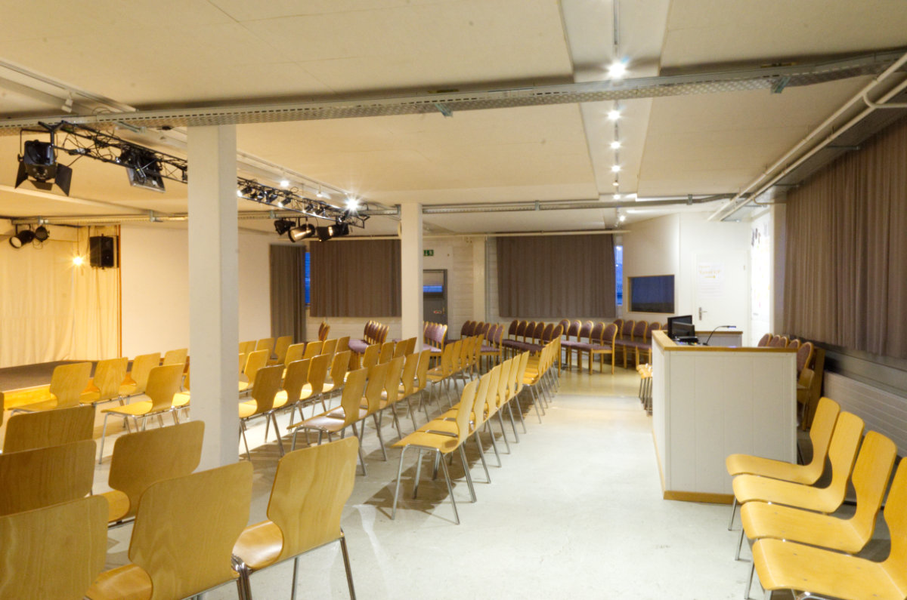

  
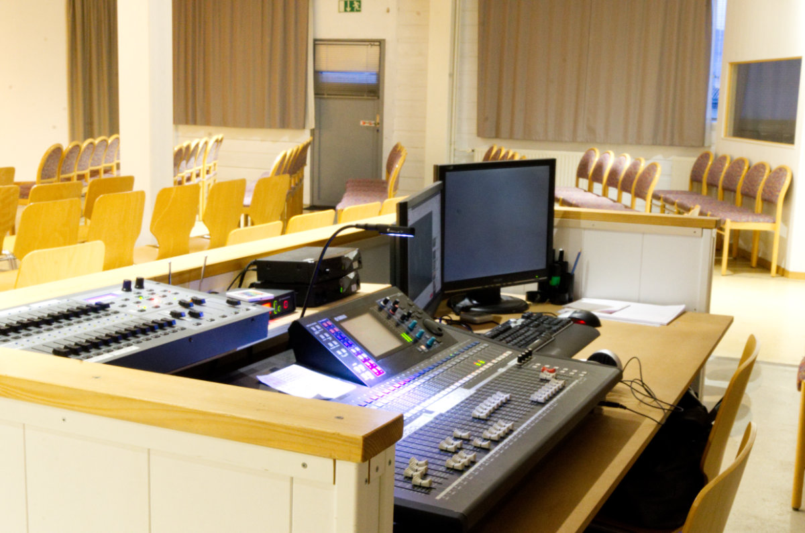

