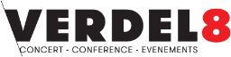

{: .center-image }

Verdel 8 propose à la location les locaux de l'Eglise Evangélique de Bulle. Idéal pour conférences, anniversaires ou autres événements.
  
 
## Nous proposons ainsi à la location :
-	1 grande salle avec 150 chaises, scène, éclairage, projection double-écran et sonorisation
-	1 cafétéria avec cuisine équipée, 50 places assises et espace avec petite scène + sonorisation
-	1 bar avec snacks et boissons

  

  

## Courts descriptifs (avec liens pour plus de détails):

### Grande salle (150 places)
La grande salle est sonorisée et des micros pour voix ou instruments de musique sont disponibles. Deux beamers assurent une projection optimale dans la salle. Un technicien peut assurer la sonorisation et la projection. Au fond de la salle, un espace pour les bébés est aménagé avec des jouets. Une cabine de traduction insonorisée est également à disposition.

[> Plus de détails sur la grande salle](grandesalle.html)

### Cafétéria (50 places)
La cafétéria permet de cuisiner et servir facilement 50 personnes et possède notamment un combi-steamer et un lave-vaisselle professionnel. Un coin lounge se trouve au fond de la cafétéria et possède des canapés où une dizaine de personnes peuvent s’installer confortablement. Un beamer est également à disposition.

[> Plus de détail sur la cafétéria](cafeteria.html) 

### Bar
Le bar vend des boissons rafraichissantes, des cafés et divers snacks. Dans le cas où cette prestation est souhaitée, une personne de Verdel 8 assurera le service et sera défrayée selon le salaire horaire ci-dessous.

## Accès
Les possibilités de parking sont les suivantes : la semaine dès 19h et les weekends, parking gratuit juste en face du bâtiment avec une trentaine de places. En semaine avant 19h, parking du tennis gratuit avec une centaine de places à 500m du bâtiment (une navette peut être organisée par nos soins sur demande).
Nos locaux sont situés dans le bâtiment violet au 1er étage à la route du Verdel 8, 1630 Bulle. Il est équipé d’un monte-charge. Un espace accueil est à disposition et peut ainsi être animé par votre personnel si nécessaire.

## Prix
La location peut être sporadique ou régulière. Ci-dessous, les prix concernent la location sporadique. Pour les locations régulières, les prix sont plus avantageux. Merci de prendre contact avec nous pour ce genre de location.
<TABLE BORDER="1"> 
  <TR>
 <TH><b>Location </b> </TH> 
 <TH><b>Jusqu’à 4 heures</b></TH> 
 <TH><b>1 jour</b></TH> 
  </TR> 
  <TR> 
 <TH> <b>Grande salle</b> </TH> 
 <TD> CHF 70.- </TD> 
 <TD> CHF 100.- </TD> 
  </TR> 
  <TR> 
<TH> <b>Installation technique</b> </TH> 
 <TD> CHF 50.- </TD> 
 <TD> CHF 70.- </TD> 
  </TR> 
  <TR> 
 <TH> <b>Cafétéria</b></TH> 
 <TD> CHF 70.- </TD> 
 <TD> CHF 100.- </TD> 
  </TR> 
  <TR> 
<TH> <b>Bar</b> </TH> 
 <TD> CHF 0.- </TD> 
 <TD> CHF 0.- </TD> 
  </TR> 
  <TR> 
<TH> <b>Salaire horaire personnel* </b></TH> 
 <TD> CHF 25.- </TD> 
 <TD> CHF 25.- </TD> 
  </TR>
</TABLE>
* minimum 2H pour la personne qui vous accueillera dans les locaux (présentation, tour des locaux) et qui se chargera également de les fermer.

### N’hésitez pas à nous contacter pour plus détails sur l’équipement des salles ou pour tout autre demande d’information.
Sévin Kocher : sevin.kocher at bullenetwork.ch